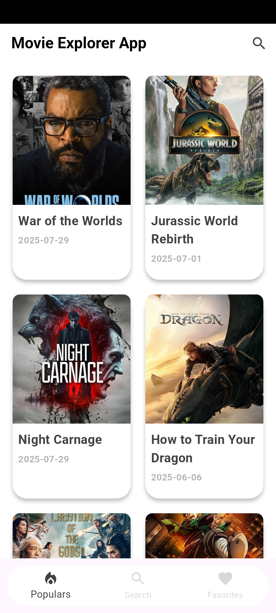

# 🎬 Movie Explorer App

**Movie Explorer** es una aplicación móvil construida en Flutter que permite a los usuarios explorar películas populares, buscar títulos, ver detalles y guardar sus favoritas de forma local. Utiliza la API pública de [The Movie Database (TMDB)](https://www.themoviedb.org/) y fue desarrollada con un enfoque en buenas prácticas de arquitectura, escalabilidad y mantenibilidad.

---

## 🚀 Funcionalidades

- ✅ Mostrar películas populares (`GET /movie/popular`)
- 🔍 Buscar películas por título (`GET /search/movie`)
- 📄 Ver detalles completos (título, sinopsis, fecha, géneros, rating, poster)
- ⭐ Guardar/Eliminar favoritas usando almacenamiento local
- 🧭 Navegación mediante `BottomNavigationBar`
- 🧱 Arquitectura limpia (Clean Architecture)
- 📦 Gestión de estado con BLoC
- 📐 UI responsiva adaptada a móviles y tablets (hasta 10")
- 🧪 Pruebas con Mockito para casos de uso y repositorios
- 💡 Aplicación de principios SOLID
- 🎨 UI basada en Material 3

---

## 📸 Capturas de Pantalla

### 📱 Móvil

| Populares | Busqueda | Favoritos |
|--------|---------|-----------|
|  |  |  |

### 💻 Tableta (10”)

| Inicio | Detalle | Favoritos |
|--------|---------|-----------|
|  |  |  |

---

## 🧱 Arquitectura y tecnologías

El proyecto sigue el patrón **Clean Architecture** con separación clara de responsabilidades entre las capas `data`, `domain`, y `presentation`.

### 🔧 Tecnologías utilizadas

| Tecnología     | Propósito                                                         |
|----------------|-------------------------------------------------------------------|
| **BLoC**        | Gestión de estado basada en eventos y estados reactivos          |
| **GetIt**       | Inyección de dependencias desacoplada                            |
| **Retrofit**    | Cliente HTTP estructurado con generación automática              |
| **Floor**       | ORM para persistencia local con SQLite                           |
| **Mockito**     | Pruebas con objetos simulados (mocked)                           |
| **Material 3**  | Diseño moderno y responsivo                                       |

---

## 📚 ¿Por qué estas tecnologías?

- **BLoC:** Proporciona una forma estructurada y escalable de manejar la lógica de presentación basada en flujos reactivos.
- **GetIt:** Permite inyectar servicios, repositorios y BLoCs sin acoplamientos directos, facilitando testing y modularidad.
- **Retrofit:** Provee un cliente HTTP robusto, con anotaciones, generación de código y compatibilidad con modelos tipados.
- **Floor:** Ofrece un ORM limpio y eficiente para usar SQLite con anotaciones, útil para manejar favoritos localmente.
- **Mockito:** Se utilizó para testear casos de uso y repositorios sin necesidad de usar dependencias reales o APIs externas.

---

## 💡 Diseño Responsivo

La interfaz fue diseñada para **adaptarse automáticamente** a diferentes tamaños de pantalla, incluyendo:

- Teléfonos móviles
- Tabletas de hasta **10 pulgadas**

Se utilizaron widgets como `LayoutBuilder`, `MediaQuery`, y diseño fluido basado en proporciones para asegurar una experiencia de usuario coherente y usable en todos los dispositivos.

---

## 🧭 Principios SOLID aplicados

El código sigue los **principios SOLID**, lo cual facilita el mantenimiento, testing y escalabilidad del proyecto:

| Principio | Descripción | Aplicación en el proyecto |
|----------|-------------|----------------------------|
| **S - Single Responsibility** | Una clase debe tener una única responsabilidad | Casos de uso, BLoC, repositorios y vistas tienen responsabilidades bien definidas |
| **O - Open/Closed** | Abierto a extensión, cerrado a modificación | Puedes extender lógica (como fuentes de datos) sin modificar implementaciones existentes |
| **L - Liskov Substitution** | Las subclases deben sustituir correctamente a sus clases padre | Implementaciones de repositorios pueden reemplazar sus interfaces sin romper la lógica |
| **I - Interface Segregation** | Las interfaces deben ser específicas y no forzar implementaciones innecesarias | Interfaces separadas en `domain` que exponen sólo los métodos requeridos |
| **D - Dependency Inversion** | Depender de abstracciones, no implementaciones | Repositorios y casos de uso dependen de interfaces inyectadas con GetIt |

---

## 📂 Estructura del proyecto

